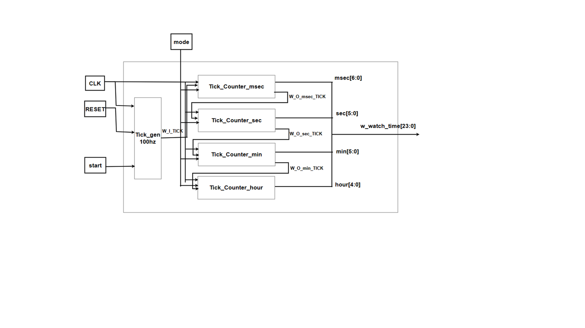

# UART + SR04 + DHT11 + Stopwatch + Watch

FPGA : Basys3  
7-segment display : Common Anode  
Frequency : 100 MHz  

Tool : Vivado, VS Code

---

## Design Goal

### 1. STOPWATCH Function

`sw[1] = 0` : Stopwatch Mode

| Condition | Description |
|---|---|
| Initial Value | `00:00:00.00` |
| `sw[5:3]` | `3'bxxx` |
| `sw[0] = 0` + Right Button | Start / Increase stopwatch time |
| `sw[0] = 1` + Right Button | Start / Decrease stopwatch time |
| Left Button or Reset Button | Clear stopwatch time to initial value |
| `sw[1] = 1` | Hour : Min mode |
| `sw[1] = 0` | Sec : Msec mode |

---

### 2. WATCH Function

`sw[1] = 1` : Watch Mode

| Condition | Description |
|---|---|
| Initial Value | `12:00:00.00` |
| `sw[0] = 1` | Normal watch |
| `sw[0] = 0` | Change clock time using left, right, up, down button |

#### Button Control

| Button | Function |
|---|---|
| Right Button | Min, Msec UP |
| Left Button | Hour, Sec UP |
| Up Button | Min, Msec DOWN |
| Down Button | Hour, Sec DOWN |

---

### 3. SR04

`sw[5:0] = 6'b001000`

#### SPEC

| Item | Value |
|---|---|
| Distance | 2 ~ 400 cm |
| Angle | -15º ~ 15º |
| Output Signal | HIGH pulse |

The sensor cannot measure distance exactly, so we measure the average distance value for 2 sec.

| Button | Function |
|---|---|
| Right Button | Start Measuring Button |

---

### 4. DHT11

#### SPEC

| Item | Value |
|---|---|
| Humidity | 20% ~ 90% |
| Temperature | 0ºC ~ 50ºC |

#### Humidity Mode

`sw[5:0] = 6'b110000`

The sensor cannot measure humidity exactly, so we measure the average humidity value for 2 sec.

#### Temperature Mode

`sw[5:0] = 6'b010000`

The sensor cannot measure temperature exactly, so we measure the average temperature value for 2 sec.

| Button | Function |
|---|---|
| Right Button | Start Measuring Button |

---

## Block Diagram

### 1. STOPWATCH

`tick_gen_100hz = 10 msec`

The stopwatch uses tick count to make time.

| Time Unit | Range | Bit Width |
|---|---:|---:|
| Hour | 0 ~ 23 | 5 bit |
| Min | 0 ~ 59 | 6 bit |
| Sec | 0 ~ 59 | 6 bit |
| Msec | 0 ~ 99 | 7 bit |

---

### 2. WATCH

The watch structure is similar to the stopwatch.

---

### 3. FULL

---

## Verification

To verify this project, we made SystemVerilog code like UVM.

---

### 1. STOPWATCH_WATCH B/D

#### Scenario

| No. | Scenario | Expected Result |
|---:|---|---|
| 1 | Reset | `12:00:00:00` |
| 2 | Stopwatch | msec > sec, sec > min, min > hour |
| 3 | Watch | msec > sec, sec > min, min > hour |
| 4 | Change Time | Check time change operation |
| 5 | Button | Check button operation |

---

### 2. FIFO B/D

#### Scenario

| Mode | Scenario |
|---|---|
| PUSH MODE | `!FULL` = `wptr++`, `empty = 0`, if `wptr == rptr`, then `FULL` |
| POP MODE | `!empty` = `rptr++`, `full = 0`, if `rptr == wptr`, then `EMPTY` |
| BOTH | `FULL` = `rptr++`, `full = 0` |
| BOTH | `empty` = `wptr++`, `empty = 0` |
| BOTH | Extra = `wptr++`, `rptr++` |

---

### 3. UART RX B/D

#### Scenario

| Item | Description |
|---|---|
| Driver Task | UART_TX |
| Timing | UART timing to give 16 tick |
| Mailbox | Add a mailbox between the generator and the scoreboard |
| Compare | Random 8-bit TX value is compared with `rx_data` value in `mon2scb_mailbox` |

---

### 4. UART FULL B/D

   

#### Scenario

| Item | Description |
|---|---|
| Monitor Task | Receive the value imported from the interface reliably |
| Sampling Timing | A total of 1.5 `BIT_PERIOD` is received so that it can be received from the middle, 8 ticks |
| Loop Back UART | Compare the result data with the random data received through `gen2scb_mailbox` and `mon2scb_mailbox` |

---

## Presentation

In the bottom, it is our presentation.

- [STOPWATCH,WATCH.pdf](https://github.com/user-attachments/files/28661408/STOPWATCH.WATCH.pdf)
- [UART_FIFO_SR04_DHT11_STOPWATCH,WATCH.pdf](https://github.com/user-attachments/files/28661409/UART_FIFO_SR04_DHT11_STOPWATCH.WATCH.pdf)
- [Verification.pdf](https://github.com/user-attachments/files/28661413/Verification.pdf)

