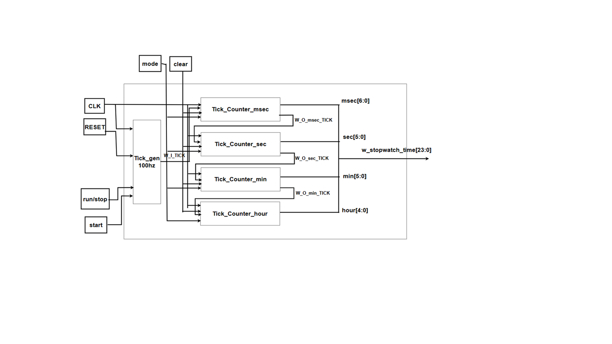
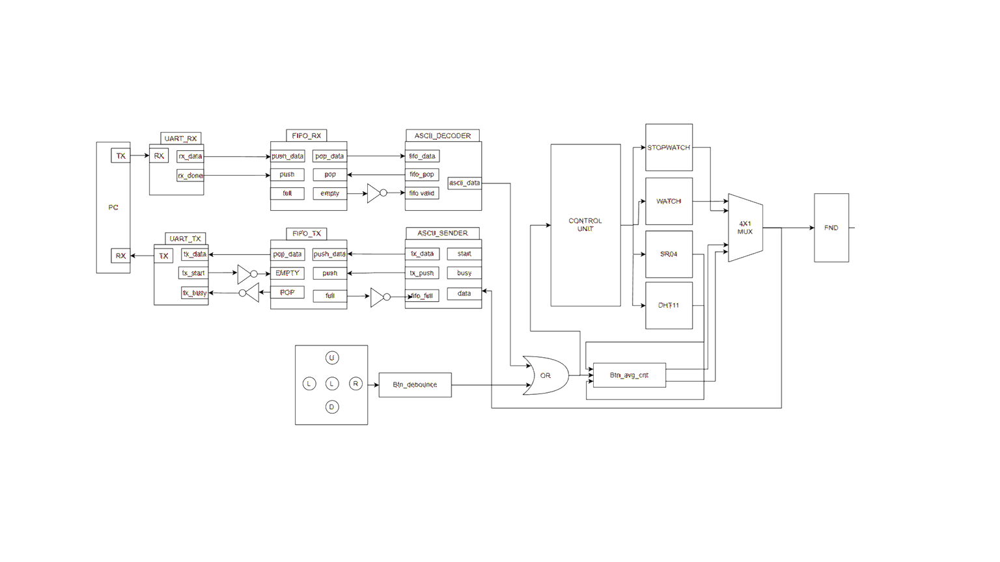
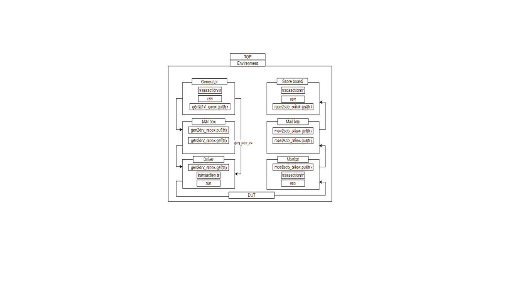
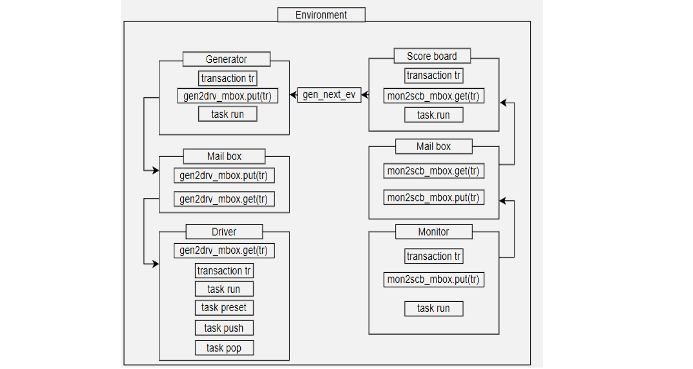
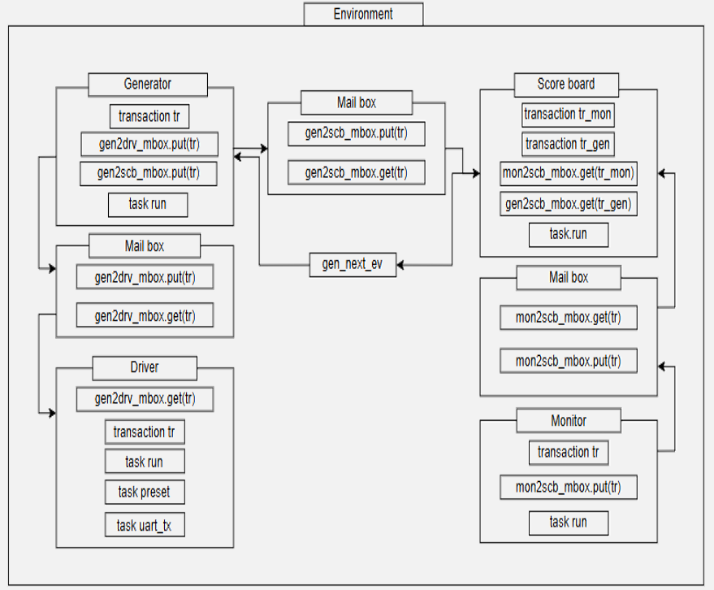
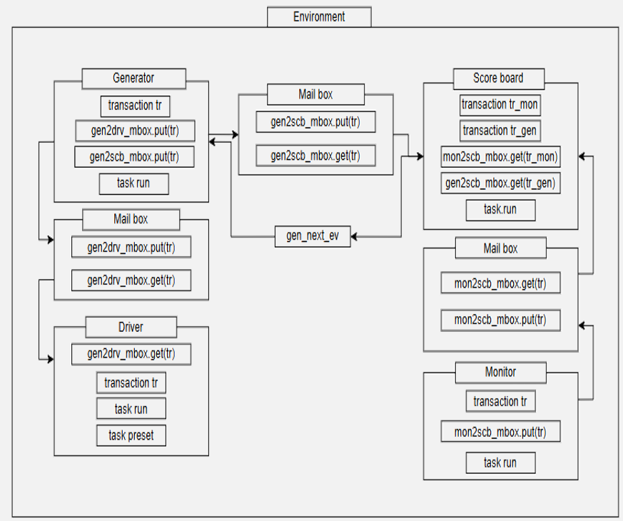

FPGA : Basys3(7-segment display는 common anode)
Frequency = 100Mhz

Tool : Vivado , VS code

Design Goal
1. STOPWATCH Function(sw[1] = 0, stopwatch mode)
   1) initial value = 00:00:00.00, sw[5:3] = 3'bxxx;
   2) sw[0] = 0, press right btn(START) = increase stopwatch time(msec)
   3) sw[1] = 1, press right btn(START) = decrease stopwatch time(msec)
   4) press left btn or rst btn = clear stopwatch time to initial value
   5) sw[1] = 1, Hour:Min mode
   6) sw[1] = 0, Sec:Msec mode

2. WATCH Function(sw[1] = 1, watch mode)
   1) initial value = 12:00:00.00
   2) sw[0] = 1, normal watch
   3) sw[1] = 0, you can change clock time using left, right, up, down btn
      1. Right btn = Min, Msec UP
      2. Left btn = Hour, Sec UP
      3. Up btn = Min, Msec DOWN
      4. Down btn = Hour, Sec DOWN

3. SR04(sw[5:0] = 6'b001000)
   1) SPEC
      1. Distance = 2 ~ 400cm
      2. Angle = -15º ~ 15º
      4. Out Signal = HIGH pulse
   2) sensor can't measure distance exactly, so we measure the average distance value for 2sec.

4. DHT11
   1) SPEC
      1. Humidiy = 20% ~ 90%
      2. Temperature = 0ºC ~ 50ºC
   3) Humidity (sw[5:0] = 6'b110000)
      1. sensor can't measure humidity exactly, so we measure the average distance value for 2sec.  
   3) Temperature (sw[5:0] = 6'b010000)
      1. sensor can't measure temperature exactly, so we measure the average distance value for 2sec.
     

Block Diagram

1. STOPWATCH

tick_gen_100hz = 10msec  
make tick_count to make time  
hour = 0 ~ 23 , min = 0 ~ 59 , sec = 0 ~ 59 , msec = 0 ~ 99  
hour = 5bit , min = 6bit , sec = 6bit , msec = 7bit  

2. WATCH 

same like stopwatch
3. FULL

in the bottom, it is our presentation.   
[UART_SR04_DHT11_STOPWATCH_WATCH.pdf](https://github.com/user-attachments/files/25823325/UART_SR04_DHT11_STOPWATCH_WATCH.pdf)

TO VERIFICATION THIS PROJECT
We make SYSTEM VERILOG CODE LIKE UVM

1. STOPWATCH_WATCH B/D  
    
   SCENARIO 
   1) RESET
      * result = 12:00:00:00
   2) Stopwatch
   3) Watch
      * msec>sec, sec>min, min>hour
   4) Change Time
   5) Btn

3. FIFO B/D  
    
    SCENARIO  
   1) PUSH MODE 
      * !FULL = wptr ++, empty = 0, if (wptr = rptr) = FULL 
   2) POP MODE 
      * !empty = rptr ++, full = 0, if (rptr= wptr) = EMPTY 
   3) BOTH 
      * FULL = rptr ++, full = 0 
      * empty = wptr ++, empty = 0 
      * extra = wptr ++, rptr ++ 
       
4. UART RX B/D  
    
    SCENARIO  
   1) Driver Task(UART_TX)
      * Timing UART to give 16tick.
      * Add a mailbox between the generator and the Scoreboard,
      * rand 8-bit TX value compared to rx_data value in mon2scb_mailbox.
       
5. UART FULL B/D  
   
    SCENARIO  
   1) Monitor TASK
      * To receive the value imported from the interface reliably
      * A total of 1.5 BIT_PERIOD is received so that it can be received from the middle (8 ticks).
   2) Loop Back UART
      * Compare the result data with the rand data received through gen2scb_mailbox and mon2scb_mailbox.

